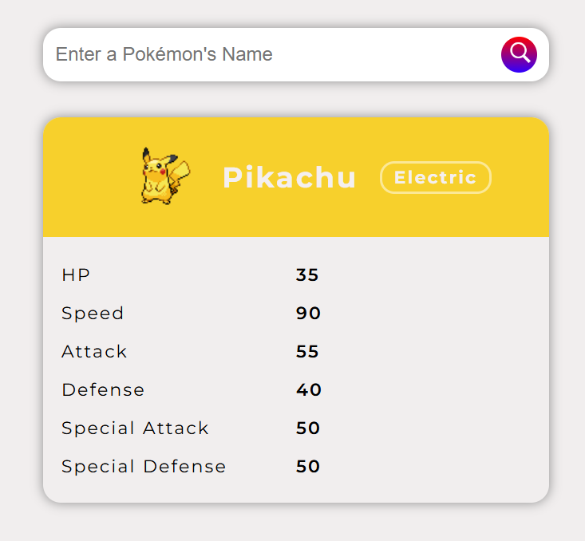
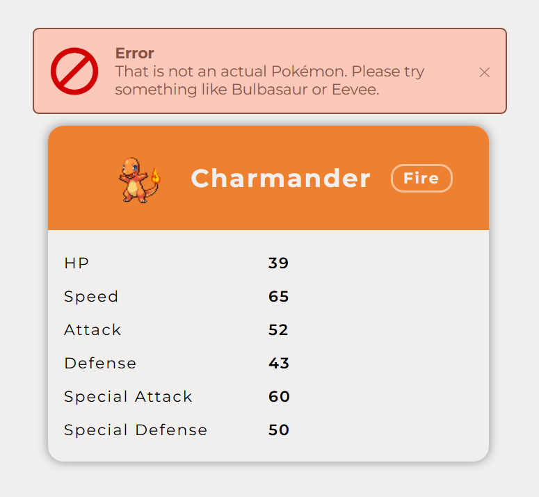

# Pokémon Lookup App

A simple and interactive Pokémon lookup web app built with **HTML, CSS, and JavaScript**, powered by the [**PokéAPI**](https://pokeapi.co/).  
Users can search for a Pokémon by name and view its sprite, type(s), and base stats in a clean, responsive UI.

## Features

- Search Pokémon by name
- Displays official Pokémon sprite
- Shows Pokémon type(s) with styled badges
- Lists base stats (HP, Attack, Defense, etc.)
- Hover and click animations for interactivity
- User-friendly error message for invalid Pokémon names

## Built With

- HTML
- CSS (Flexbox, transitions)
- JavaScript
- [PokéAPI](https://pokeapi.co/)

## What I Learned

- Fetching and handling data from an external API
- Using async/await and handling errors (404 responses)
- Dynamically updating the DOM
- Improving UI with animations and conditional styling

## Error Handling

If a user enters an invalid Pokémon name, the app handles the API’s 404 response and displays a clear error message without breaking the UI.

## Screenshot

### The Webpage

### Error for Invalid Pokémon Names

## Live Demo 

[View Website](https://maher-wahid.github.io/pokedex-web/)